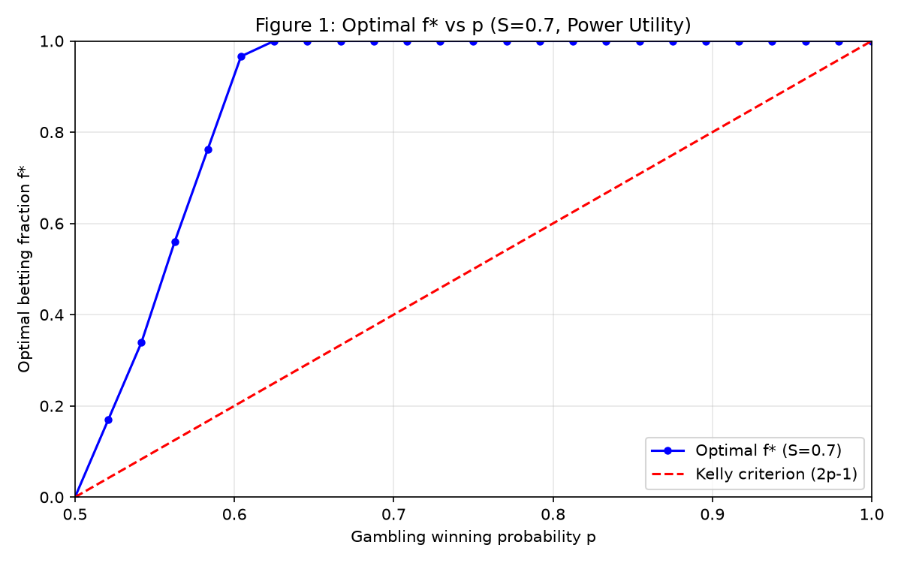
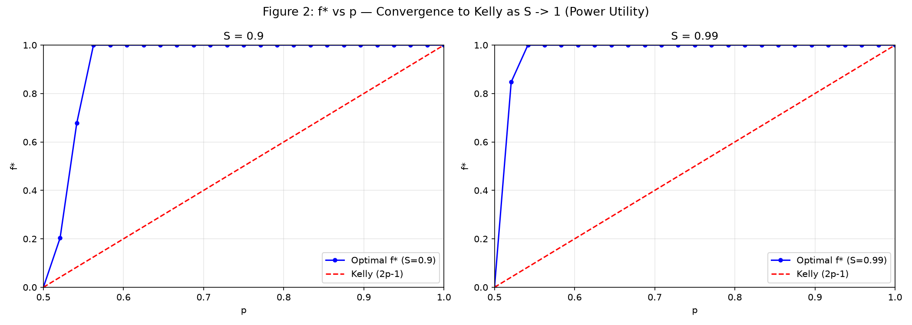
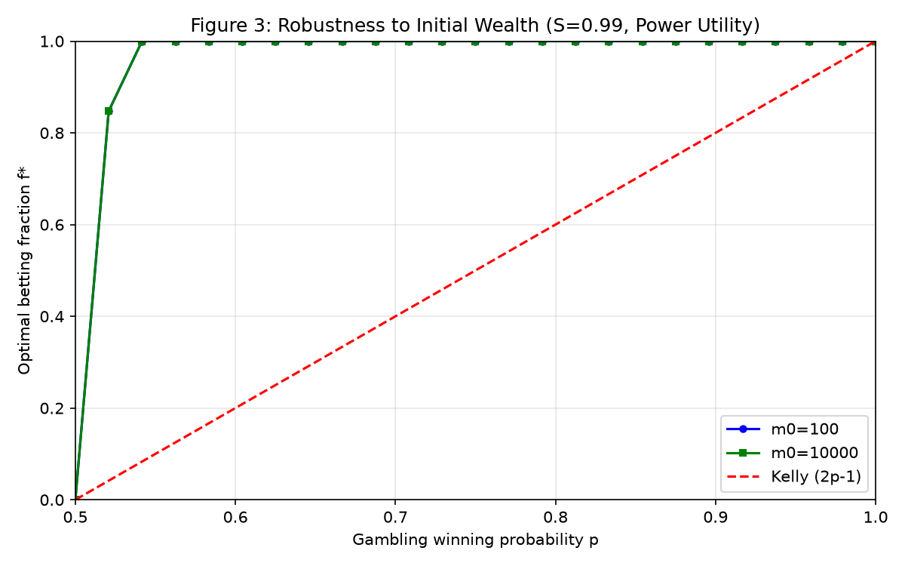
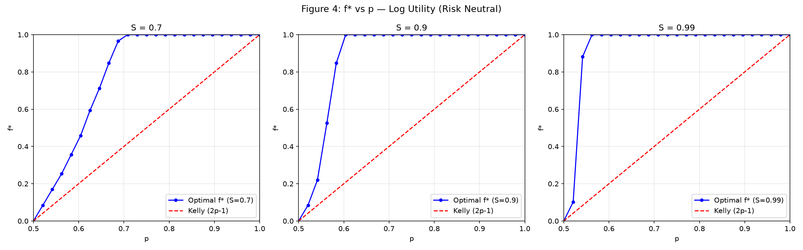
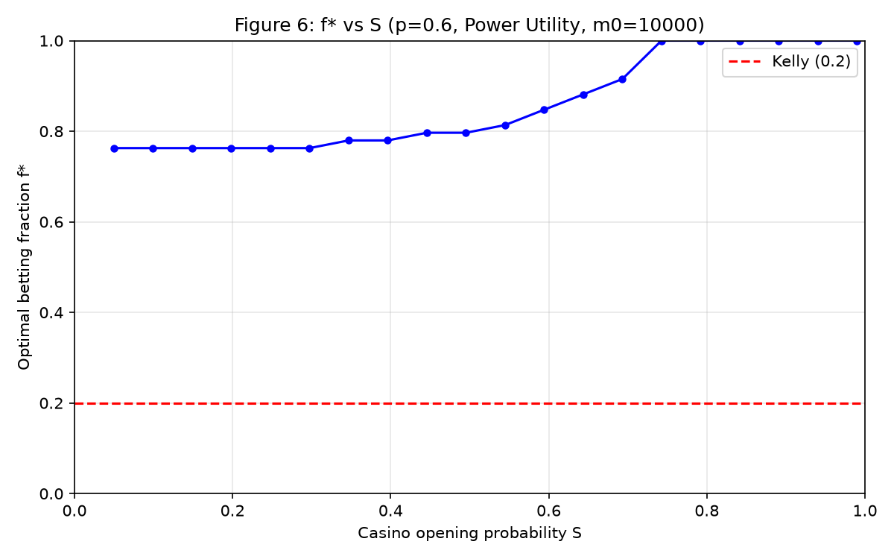
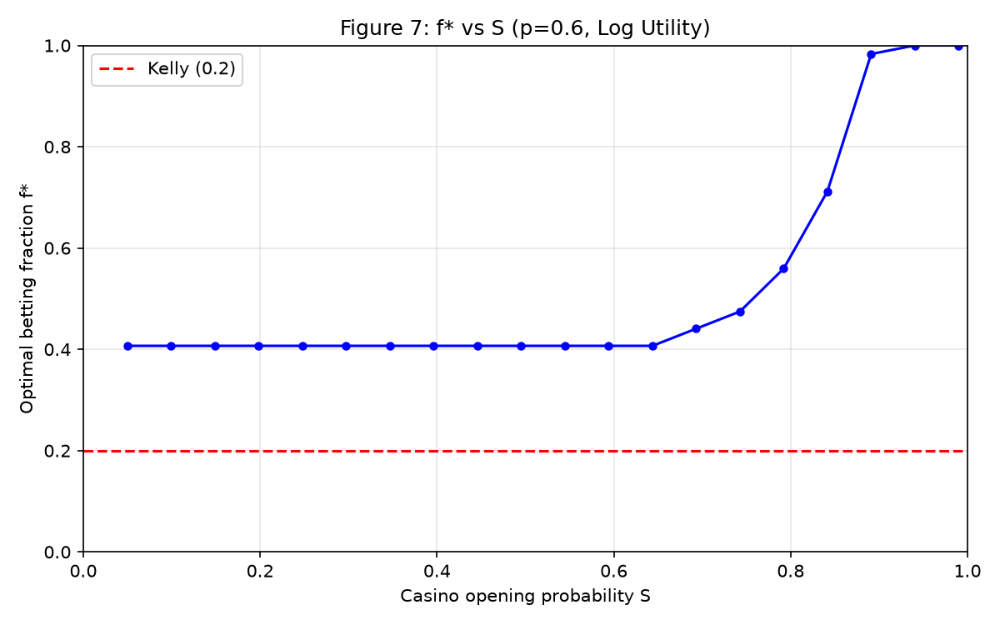
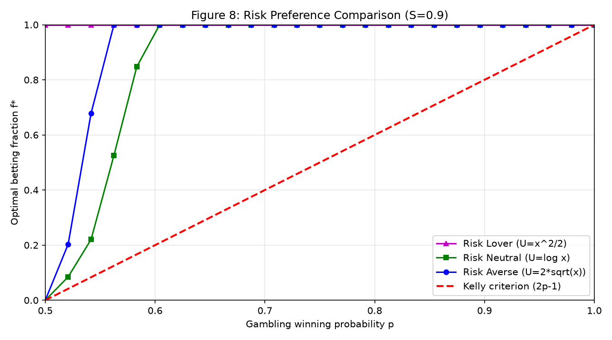

# Casino Gambling Model

Optimal betting strategies in a stochastic casino environment with random open/close states.

## Problem

A player gambles at a casino that opens with probability **S** each period. The player must decide what fraction **f** of their wealth to bet each round to maximize expected utility over a finite horizon.

## Key Result

As the casino opening probability **S → 1**, the optimal betting fraction converges to the **Kelly criterion**: `f* = 2p - 1`, where `p` is the probability of winning a gamble.

## Utility Functions

| Type | Function | Shape | Behavior |
|------|----------|-------|----------|
| Risk Averse | `U(x) = 2√x` | Concave | Bets less than Kelly |
| Risk Neutral | `U(x) = log(x)` | Concave | Bets close to Kelly |
| Risk Lover | `U(x) = x²/2` | Convex | Bets more than Kelly |

## Repository Structure

```
Casino/
├── README.md                          # This file
├── docs/
│   ├── architecture.md                # Full mathematical model & theory
│   ├── casino model.pdf               # Original model writeup
│   └── Vt(x)_plots.pdf               # Presentation with result plots
├── src/
│   ├── model.py                       # Numerical DP solver
│   └── plots.py                       # Figure generation script
└── figures/
    ├── figure1.png                    # f* vs p (S=0.7, risk averse)
    ├── figure2.png                    # f* vs p (S=0.9 & 0.99, Kelly convergence)
    ├── figure3.png                    # f* vs p (wealth robustness)
    ├── figure4.png                    # f* vs p (log utility, 3 panels)
    ├── figure5.png                    # f* vs S (risk averse, m0=100)
    ├── figure6.png                    # f* vs S (risk averse, m0=10000)
    ├── figure7.png                    # f* vs S (log utility)
    └── figure8.png                    # All 3 risk types compared
```

## Quick Start

```bash
pip install numpy matplotlib
cd src
python model.py       # Run the solver with default parameters
python plots.py       # Generate all plots (saves to ../figures/)
```

## Parameters

| Parameter | Default | Description |
|-----------|---------|-------------|
| `p` | 0.8 | Win probability |
| `S` | 0.3 | Casino open probability |
| `g` | 0.5 | Win/loss rate |
| `m0` | 100 | Initial wealth |
| `T` | 50 | Time horizon |

## Results

### Risk Averse vs. Winning Probability (S=0.7)



As **p** increases, the optimal bet fraction increases but stays below the Kelly line. The risk-averse player bets conservatively.

### Convergence to Kelly as S → 1



Left: S=0.9. Right: S=0.99. As the casino stays open more often, the optimal f* approaches the Kelly criterion **f* = 2p - 1**.

### Robustness to Initial Wealth



The optimal betting fraction is identical for m₀=100 and m₀=10,000 — wealth level doesn't matter.

### Log Utility (Risk Neutral)



Three panels for S=0.7, 0.9, 0.99 under log utility. The risk-neutral player converges to Kelly smoothly.

### f* vs Casino Opening Probability (Risk Averse)


As S decreases (casino less reliable), the player bets more aggressively — each bet may be the last.

### f* vs Casino Opening Probability (Wealth Robustness)



Same as Figure 5 with m₀=10,000 — identical results confirm wealth independence.

### f* vs Casino Opening Probability (Log Utility)



The risk-neutral player's bet size drops more gradually as S decreases compared to the risk-averse player.

### Risk Preference Comparison



All three utility types at S=0.9:
- **Risk lover** (magenta): Bets the most — often everything
- **Risk neutral** (green): Bets close to Kelly
- **Risk averse** (blue): Bets the least — well below Kelly
- **Kelly** (red dashed): Theoretical benchmark

### Numerical Results

**f* vs p (log utility, different S):**

| p | Kelly | S=0.7 | S=0.9 | S=0.99 |
|---|-------|-------|-------|--------|
| 0.5 | 0.0000 | 0.0000 | 0.0000 | 0.0000 |
| 0.6 | 0.2000 | 0.4407 | 1.0000 | 1.0000 |
| 0.7 | 0.4000 | 1.0000 | 1.0000 | 1.0000 |
| 0.8 | 0.6000 | 1.0000 | 1.0000 | 1.0000 |
| 0.9 | 0.8000 | 1.0000 | 1.0000 | 1.0000 |

**f* vs S (p=0.6, all utility types):**

| S | Log (neutral) | Power (averse) | Risk Lover | Kelly |
|---|---------------|----------------|-----------|-------|
| 0.30 | 0.4068 | 0.7627 | 1.0000 | 0.2000 |
| 0.50 | 0.4068 | 0.7966 | 1.0000 | 0.2000 |
| 0.70 | 0.4407 | 0.9322 | 1.0000 | 0.2000 |
| 0.90 | 1.0000 | 1.0000 | 1.0000 | 0.2000 |
| 0.99 | 1.0000 | 1.0000 | 1.0000 | 0.2000 |
